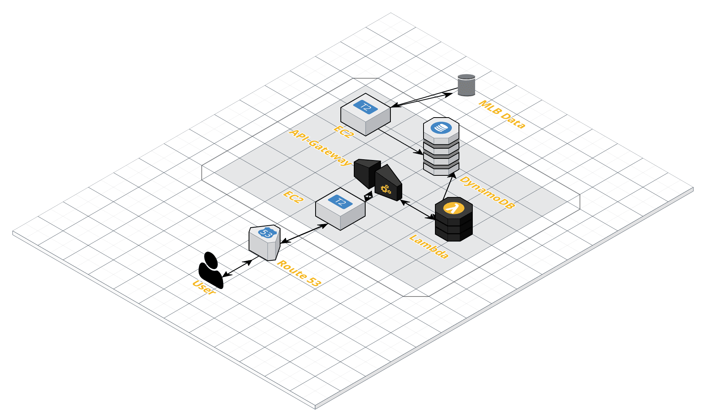

# MLB Game Data

CMSC389L Final Project 
Ronald Davis

## Overview

This application allows users to find out current year up-to-date statistics on their favorite or other MLB teams.
It will gather information on all MLB games daily and update the database.
When the user enters the team it wants to see, the database is queried through an API and Lamdba functions and the resulting data is displayed.

## Services Used

- EC2
- Route 53 hosted [here](www.ronalddavis.tech)
- DynamoDB
- API Gateway
- Lambda

## Youtube Video Demo

[Video Demo](www.youtube.com)

## Architecture Diagram

### API Overview

/awaylosses/{teamName}	 
/awaywins/{teamName} 
/gameslost/{teamName} 
/gameswon/{teamName} 
/homelosses/{teamName} 
/homewins/{teamName} 
/winsgreater/{teamName}{runs} 
/lossesgreater/{teamName}{runs} 
/winslesseq/{teamName}{runs} 
/losseslesseq/{teamName}{runs} 
	
### How to Run It

Create DynamoDB table called 'MLBGames' with schema: 
	{ 
    	"Table": { 
        	"AttributeDefinitions": [ 
            	{ 
                	"AttributeName": "gameID", 
                	"AttributeType": "S" 
            	} 
        	], 
        	"TableName": "MLBGames", 
        	"KeySchema": [ 
            	{ 
               		"AttributeName": "gameID", 
                	"KeyType": "HASH" 
            	} 
        	], 
        	"TableStatus": "ACTIVE", 
        	"CreationDateTime": 1523836695.374, 
        	"ProvisionedThroughput": { 
            	"NumberOfDecreasesToday": 0, 
            	"ReadCapacityUnits": 10, 
            	"WriteCapacityUnits": 10 
        	}, 
    	} 

